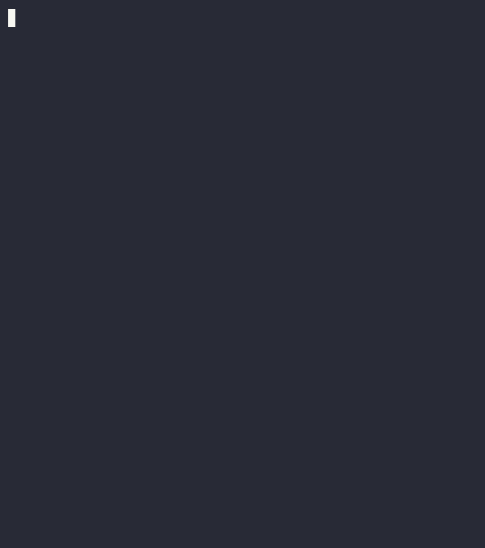
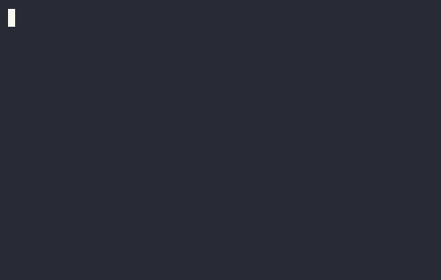

# markdown.nvim

Plugin to improve viewing Markdown files in Neovim

|                                            |                                    |
| ------------------------------------------ | ---------------------------------- |
|      |  |
|  |            |
|                |                                    |

# Features

- Functions entirely inside of Neovim with no external windows
- Changes between `rendered` view in normal mode and `raw` view in all other modes
- Supports anti-conceal behavior, removing any virtual text added by this plugin
  on the line the cursor is on, this does have a performance penalty and can be disabled
- Changes window options between `rendered` and `raw` view based on configuration
  - Effects `conceallevel` & `concealcursor` by default
- Supports rendering `markdown` injected into other file types
- Renders the following `markdown` components:
  - Headings: highlight depending on level and replaces `#` with icon
  - Horizontal breaks: replace with full-width lines
  - Code blocks: highlight to better stand out
    - Adds language icon [^1], requires icon provider (`mini.icons` or `nvim-web-devicons`)
    - Left pad lines within block [^1]
  - Inline code: highlight to better stand out
  - List bullet points: replace with provided icon based on level
  - Checkboxes: replace with provided icon based on whether they are checked
  - Block quotes: replace leading `>` with provided icon
  - Tables: replace border characters, does NOT automatically align
  - [Callouts](https://github.com/orgs/community/discussions/16925)
    - Github & Obsidian out of the box, supports user defined as well
  - Custom checkbox states [^1], function similar to `callouts`
  - Adds icon before images / links [^1]
  - `LaTeX` blocks: renders formulas if `latex` parser and `pylatexenc` are installed
- Disable rendering when file is larger than provided value
- Support custom handlers which are ran identically to builtin handlers

[^1]: Requires neovim >= `0.10.0`

# Requirements

- neovim `>= 0.9.0` (minimum) `>= 0.10.0` (recommended)
- [treesitter](https://github.com/nvim-treesitter/nvim-treesitter) parsers:
  - [markdown & markdown_inline](https://github.com/tree-sitter-grammars/tree-sitter-markdown):
    Used to parse `markdown` files
  - [latex](https://github.com/latex-lsp/tree-sitter-latex) (Optional):
    Used to get `LaTeX` blocks from `markdown` files
- Icon provider plugin (Optional): Used for icon above code blocks
  - [mini.icons](https://github.com/echasnovski/mini.nvim/blob/main/readmes/mini-icons.md)
  - [nvim-web-devicons](https://github.com/nvim-tree/nvim-web-devicons)
- System dependencies:
  - [pylatexenc](https://pypi.org/project/pylatexenc/) (Optional):
    Used to transform `LaTeX` strings to appropriate unicode using `latex2text`

# Install

## lazy.nvim

```lua
{
    'MeanderingProgrammer/markdown.nvim',
    name = 'render-markdown', -- Only needed if you have another plugin named markdown.nvim
    dependencies = { 'nvim-treesitter/nvim-treesitter', 'echasnovski/mini.nvim' }, -- if you use the mini.nvim suite
    -- dependencies = { 'nvim-treesitter/nvim-treesitter', 'echasnovski/mini.icons' }, -- if you use standalone mini plugins
    -- dependencies = { 'nvim-treesitter/nvim-treesitter', 'nvim-tree/nvim-web-devicons' }, -- if you prefer nvim-web-devicons
    config = function()
        require('render-markdown').setup({})
    end,
}
```

## packer.nvim

```lua
use({
    'MeanderingProgrammer/markdown.nvim',
    as = 'render-markdown', -- Only needed if you have another plugin named markdown.nvim
    after = { 'nvim-treesitter' },
    requires = { 'echasnovski/mini.nvim', opt = true }, -- if you use the mini.nvim suite
    -- requires = { 'echasnovski/mini.icons', opt = true }, -- if you use standalone mini plugins
    -- requires = { 'nvim-tree/nvim-web-devicons', opt = true }, -- if you prefer nvim-web-devicons
    config = function()
        require('render-markdown').setup({})
    end,
})
```

# Commands

- `:RenderMarkdown` | `:RenderMarkdown enable` - Enable this plugin
  - Can also be accessed directly through `require('render-markdown').enable()`
- `:RenderMarkdown disable` - Disable this plugin
  - Can also be accessed directly through `require('render-markdown').disable()`
- `:RenderMarkdown toggle` - Switch between enabling & disabling this plugin
  - Can also be accessed directly through `require('render-markdown').toggle()`

# Setup

The full default configuration is provided below for reference.

Any part of it can be modified however for many fields this does not make much sense.

Some of the more useful fields are discussed further down.

<details>

<summary>Full Default Configuration</summary>

```lua
require('render-markdown').setup({
    -- Whether Markdown should be rendered by default or not
    enabled = true,
    -- Maximum file size (in MB) that this plugin will attempt to render
    -- Any file larger than this will effectively be ignored
    max_file_size = 1.5,
    -- Capture groups that get pulled from markdown
    markdown_query = [[
        (atx_heading [
            (atx_h1_marker)
            (atx_h2_marker)
            (atx_h3_marker)
            (atx_h4_marker)
            (atx_h5_marker)
            (atx_h6_marker)
        ] @heading)

        (thematic_break) @dash

        (fenced_code_block) @code

        [
            (list_marker_plus)
            (list_marker_minus)
            (list_marker_star)
        ] @list_marker

        (task_list_marker_unchecked) @checkbox_unchecked
        (task_list_marker_checked) @checkbox_checked

        (block_quote) @quote

        (pipe_table) @table
    ]],
    -- Capture groups that get pulled from quote nodes
    markdown_quote_query = [[
        [
            (block_quote_marker)
            (block_continuation)
        ] @quote_marker
    ]],
    -- Capture groups that get pulled from inline markdown
    inline_query = [[
        (code_span) @code

        (shortcut_link) @callout

        [(inline_link) (image)] @link
    ]],
    -- Query to be able to identify links in nodes
    inline_link_query = '[(inline_link) (image)] @link',
    -- The level of logs to write to file: vim.fn.stdpath('state') .. '/render-markdown.log'
    -- Only intended to be used for plugin development / debugging
    log_level = 'error',
    -- Filetypes this plugin will run on
    file_types = { 'markdown' },
    -- Vim modes that will show a rendered view of the markdown file
    -- All other modes will be uneffected by this plugin
    render_modes = { 'n', 'c' },
    exclude = {
        -- Buftypes ignored by this plugin, see :h 'buftype'
        buftypes = {},
    },
    anti_conceal = {
        -- This enables hiding any added text on the line the cursor is on
        -- This does have a performance penalty as we must listen to the 'CursorMoved' event
        enabled = true,
    },
    latex = {
        -- Whether LaTeX should be rendered, mainly used for health check
        enabled = true,
        -- Executable used to convert latex formula to rendered unicode
        converter = 'latex2text',
        -- Highlight for LaTeX blocks
        highlight = 'RenderMarkdownMath',
    },
    heading = {
        -- Turn on / off heading icon & background rendering
        enabled = true,
        -- Turn on / off any sign column related rendering
        sign = true,
        -- Replaces '#+' of 'atx_h._marker'
        -- The number of '#' in the heading determines the 'level'
        -- The 'level' is used to index into the array using a cycle
        -- The result is left padded with spaces to hide any additional '#'
        icons = { '󰲡 ', '󰲣 ', '󰲥 ', '󰲧 ', '󰲩 ', '󰲫 ' },
        -- Added to the sign column if enabled
        -- The 'level' is used to index into the array using a cycle
        signs = { '󰫎 ' },
        -- The 'level' is used to index into the array using a clamp
        -- Highlight for the heading icon and extends through the entire line
        backgrounds = {
            'RenderMarkdownH1Bg',
            'RenderMarkdownH2Bg',
            'RenderMarkdownH3Bg',
            'RenderMarkdownH4Bg',
            'RenderMarkdownH5Bg',
            'RenderMarkdownH6Bg',
        },
        -- The 'level' is used to index into the array using a clamp
        -- Highlight for the heading and sign icons
        foregrounds = {
            'RenderMarkdownH1',
            'RenderMarkdownH2',
            'RenderMarkdownH3',
            'RenderMarkdownH4',
            'RenderMarkdownH5',
            'RenderMarkdownH6',
        },
    },
    code = {
        -- Turn on / off code block & inline code rendering
        enabled = true,
        -- Turn on / off any sign column related rendering
        sign = true,
        -- Determines how code blocks & inline code are rendered:
        --  none: disables all rendering
        --  normal: adds highlight group to code blocks & inline code, adds padding to code blocks
        --  language: adds language icon to sign column if enabled and icon + name above code blocks
        --  full: normal + language
        style = 'full',
        -- Amount of padding to add to the left of code blocks
        left_pad = 0,
        -- Determins how the top / bottom of code block are rendered:
        --  thick: use the same highlight as the code body
        --  thin: when lines are empty overlay the above & below icons
        border = 'thin',
        -- Used above code blocks for thin border
        above = '▄',
        -- Used below code blocks for thin border
        below = '▀',
        -- Highlight for code blocks & inline code
        highlight = 'RenderMarkdownCode',
    },
    dash = {
        -- Turn on / off thematic break rendering
        enabled = true,
        -- Replaces '---'|'***'|'___'|'* * *' of 'thematic_break'
        -- The icon gets repeated across the window's width
        icon = '─',
        -- Highlight for the whole line generated from the icon
        highlight = 'RenderMarkdownDash',
    },
    bullet = {
        -- Turn on / off list bullet rendering
        enabled = true,
        -- Replaces '-'|'+'|'*' of 'list_item'
        -- How deeply nested the list is determines the 'level'
        -- The 'level' is used to index into the array using a cycle
        -- If the item is a 'checkbox' a conceal is used to hide the bullet instead
        icons = { '●', '○', '◆', '◇' },
        -- Highlight for the bullet icon
        highlight = 'RenderMarkdownBullet',
    },
    -- Checkboxes are a special instance of a 'list_item' that start with a 'shortcut_link'
    -- There are two special states for unchecked & checked defined in the markdown grammar
    checkbox = {
        -- Turn on / off checkbox state rendering
        enabled = true,
        unchecked = {
            -- Replaces '[ ]' of 'task_list_marker_unchecked'
            icon = '󰄱 ',
            -- Highlight for the unchecked icon
            highlight = 'RenderMarkdownUnchecked',
        },
        checked = {
            -- Replaces '[x]' of 'task_list_marker_checked'
            icon = '󰱒 ',
            -- Highligh for the checked icon
            highlight = 'RenderMarkdownChecked',
        },
        -- Define custom checkbox states, more involved as they are not part of the markdown grammar
        -- As a result this requires neovim >= 0.10.0 since it relies on 'inline' extmarks
        -- Can specify as many additional states as you like following the 'todo' pattern below
        --   The key in this case 'todo' is for healthcheck and to allow users to change its values
        --   'raw': Matched against the raw text of a 'shortcut_link'
        --   'rendered': Replaces the 'raw' value when rendering
        --   'highlight': Highlight for the 'rendered' icon
        custom = {
            todo = { raw = '[-]', rendered = '󰥔 ', highlight = 'RenderMarkdownTodo' },
        },
    },
    quote = {
        -- Turn on / off block quote & callout rendering
        enabled = true,
        -- Replaces '>' of 'block_quote'
        icon = '▋',
        -- Highlight for the quote icon
        highlight = 'RenderMarkdownQuote',
    },
    pipe_table = {
        -- Turn on / off pipe table rendering
        enabled = true,
        -- Determines how the table as a whole is rendered:
        --  none: disables all rendering
        --  normal: applies the 'cell' style rendering to each row of the table
        --  full: normal + a top & bottom line that fill out the table when lengths match
        style = 'full',
        -- Determines how individual cells of a table are rendered:
        --  overlay: writes completely over the table, removing conceal behavior and highlights
        --  raw: replaces only the '|' characters in each row, leaving the cells unmodified
        --  padded: raw + cells are padded with inline extmarks to make up for any concealed text
        cell = 'padded',
        -- Characters used to replace table border
        -- Correspond to top(3), delimiter(3), bottom(3), vertical, & horizontal
        -- stylua: ignore
        border = {
            '┌', '┬', '┐',
            '├', '┼', '┤',
            '└', '┴', '┘',
            '│', '─',
        },
        -- Highlight for table heading, delimiter, and the line above
        head = 'RenderMarkdownTableHead',
        -- Highlight for everything else, main table rows and the line below
        row = 'RenderMarkdownTableRow',
        -- Highlight for inline padding used to add back concealed space
        filler = 'RenderMarkdownTableFill',
    },
    -- Callouts are a special instance of a 'block_quote' that start with a 'shortcut_link'
    -- Can specify as many additional values as you like following the pattern from any below, such as 'note'
    --   The key in this case 'note' is for healthcheck and to allow users to change its values
    --   'raw': Matched against the raw text of a 'shortcut_link', case insensitive
    --   'rendered': Replaces the 'raw' value when rendering
    --   'highlight': Highlight for the 'rendered' text and quote markers
    callout = {
        note = { raw = '[!NOTE]', rendered = '󰋽 Note', highlight = 'RenderMarkdownInfo' },
        tip = { raw = '[!TIP]', rendered = '󰌶 Tip', highlight = 'RenderMarkdownSuccess' },
        important = { raw = '[!IMPORTANT]', rendered = '󰅾 Important', highlight = 'RenderMarkdownHint' },
        warning = { raw = '[!WARNING]', rendered = '󰀪 Warning', highlight = 'RenderMarkdownWarn' },
        caution = { raw = '[!CAUTION]', rendered = '󰳦 Caution', highlight = 'RenderMarkdownError' },
        -- Obsidian: https://help.a.md/Editing+and+formatting/Callouts
        abstract = { raw = '[!ABSTRACT]', rendered = '󰨸 Abstract', highlight = 'RenderMarkdownInfo' },
        todo = { raw = '[!TODO]', rendered = '󰗡 Todo', highlight = 'RenderMarkdownInfo' },
        success = { raw = '[!SUCCESS]', rendered = '󰄬 Success', highlight = 'RenderMarkdownSuccess' },
        question = { raw = '[!QUESTION]', rendered = '󰘥 Question', highlight = 'RenderMarkdownWarn' },
        failure = { raw = '[!FAILURE]', rendered = '󰅖 Failure', highlight = 'RenderMarkdownError' },
        danger = { raw = '[!DANGER]', rendered = '󱐌 Danger', highlight = 'RenderMarkdownError' },
        bug = { raw = '[!BUG]', rendered = '󰨰 Bug', highlight = 'RenderMarkdownError' },
        example = { raw = '[!EXAMPLE]', rendered = '󰉹 Example', highlight = 'RenderMarkdownHint' },
        quote = { raw = '[!QUOTE]', rendered = '󱆨 Quote', highlight = 'RenderMarkdownQuote' },
    },
    link = {
        -- Turn on / off inline link icon rendering
        enabled = true,
        -- Inlined with 'image' elements
        image = '󰥶 ',
        -- Inlined with 'inline_link' elements
        hyperlink = '󰌹 ',
        -- Applies to the inlined icon
        highlight = 'RenderMarkdownLink',
    },
    sign = {
        -- Turn on / off sign rendering
        enabled = true,
        -- More granular mechanism, disable signs within specific buftypes
        exclude = {
            buftypes = { 'nofile' },
        },
        -- Applies to background of sign text
        highlight = 'RenderMarkdownSign',
    },
    -- Window options to use that change between rendered and raw view
    win_options = {
        -- See :h 'conceallevel'
        conceallevel = {
            -- Used when not being rendered, get user setting
            default = vim.api.nvim_get_option_value('conceallevel', {}),
            -- Used when being rendered, concealed text is completely hidden
            rendered = 3,
        },
        -- See :h 'concealcursor'
        concealcursor = {
            -- Used when not being rendered, get user setting
            default = vim.api.nvim_get_option_value('concealcursor', {}),
            -- Used when being rendered, disable concealing text in all modes
            rendered = '',
        },
    },
    -- Mapping from treesitter language to user defined handlers
    -- See 'Custom Handlers' document for more info
    custom_handlers = {},
})
```

</details>

We use the following definitions when discussing indexing into arrays:

1. Cycle: Indexed `mod` the length.
   Example: `{ 1, 2, 3 }` @ 4 = 1.
2. Clamp: Indexed normally but larger values use the last value in the array.
   Example: `{ 1, 2, 3 }` @ 4 = 3.

## Headings

```lua
require('render-markdown').setup({
    heading = {
        -- Turn on / off heading icon & background rendering
        enabled = true,
        -- Turn on / off any sign column related rendering
        sign = true,
        -- Replaces '#+' of 'atx_h._marker'
        -- The number of '#' in the heading determines the 'level'
        -- The 'level' is used to index into the array using a cycle
        -- The result is left padded with spaces to hide any additional '#'
        icons = { '󰲡 ', '󰲣 ', '󰲥 ', '󰲧 ', '󰲩 ', '󰲫 ' },
        -- Added to the sign column if enabled
        -- The 'level' is used to index into the array using a cycle
        signs = { '󰫎 ' },
        -- The 'level' is used to index into the array using a clamp
        -- Highlight for the heading icon and extends through the entire line
        backgrounds = {
            'RenderMarkdownH1Bg',
            'RenderMarkdownH2Bg',
            'RenderMarkdownH3Bg',
            'RenderMarkdownH4Bg',
            'RenderMarkdownH5Bg',
            'RenderMarkdownH6Bg',
        },
        -- The 'level' is used to index into the array using a clamp
        -- Highlight for the heading and sign icons
        foregrounds = {
            'RenderMarkdownH1',
            'RenderMarkdownH2',
            'RenderMarkdownH3',
            'RenderMarkdownH4',
            'RenderMarkdownH5',
            'RenderMarkdownH6',
        },
    },
})
```

## Code Blocks

```lua
require('render-markdown').setup({
    code = {
        -- Turn on / off code block & inline code rendering
        enabled = true,
        -- Turn on / off any sign column related rendering
        sign = true,
        -- Determines how code blocks & inline code are rendered:
        --  none: disables all rendering
        --  normal: adds highlight group to code blocks & inline code, adds padding to code blocks
        --  language: adds language icon to sign column if enabled and icon + name above code blocks
        --  full: normal + language
        style = 'full',
        -- Amount of padding to add to the left of code blocks
        left_pad = 0,
        -- Determins how the top / bottom of code block are rendered:
        --  thick: use the same highlight as the code body
        --  thin: when lines are empty overlay the above & below icons
        border = 'thin',
        -- Used above code blocks for thin border
        above = '▄',
        -- Used below code blocks for thin border
        below = '▀',
        -- Highlight for code blocks & inline code
        highlight = 'RenderMarkdownCode',
    },
})
```

## Dashed Line

```lua
require('render-markdown').setup({
    dash = {
        -- Turn on / off thematic break rendering
        enabled = true,
        -- Replaces '---'|'***'|'___'|'* * *' of 'thematic_break'
        -- The icon gets repeated across the window's width
        icon = '─',
        -- Highlight for the whole line generated from the icon
        highlight = 'RenderMarkdownDash',
    },
})
```

## List Bullets

```lua
require('render-markdown').setup({
    bullet = {
        -- Turn on / off list bullet rendering
        enabled = true,
        -- Replaces '-'|'+'|'*' of 'list_item'
        -- How deeply nested the list is determines the 'level'
        -- The 'level' is used to index into the array using a cycle
        -- If the item is a 'checkbox' a conceal is used to hide the bullet instead
        icons = { '●', '○', '◆', '◇' },
        -- Highlight for the bullet icon
        highlight = 'RenderMarkdownBullet',
    },
})
```

## Checkboxes

```lua
require('render-markdown').setup({
    -- Checkboxes are a special instance of a 'list_item' that start with a 'shortcut_link'
    -- There are two special states for unchecked & checked defined in the markdown grammar
    checkbox = {
        -- Turn on / off checkbox state rendering
        enabled = true,
        unchecked = {
            -- Replaces '[ ]' of 'task_list_marker_unchecked'
            icon = '󰄱 ',
            -- Highlight for the unchecked icon
            highlight = 'RenderMarkdownUnchecked',
        },
        checked = {
            -- Replaces '[x]' of 'task_list_marker_checked'
            icon = '󰱒 ',
            -- Highligh for the checked icon
            highlight = 'RenderMarkdownChecked',
        },
        -- Define custom checkbox states, more involved as they are not part of the markdown grammar
        -- As a result this requires neovim >= 0.10.0 since it relies on 'inline' extmarks
        -- Can specify as many additional states as you like following the 'todo' pattern below
        --   The key in this case 'todo' is for healthcheck and to allow users to change its values
        --   'raw': Matched against the raw text of a 'shortcut_link'
        --   'rendered': Replaces the 'raw' value when rendering
        --   'highlight': Highlight for the 'rendered' icon
        custom = {
            todo = { raw = '[-]', rendered = '󰥔 ', highlight = 'RenderMarkdownTodo' },
        },
    },
})
```

## Block Quotes

```lua
require('render-markdown').setup({
    quote = {
        -- Turn on / off block quote & callout rendering
        enabled = true,
        -- Replaces '>' of 'block_quote'
        icon = '▋',
        -- Highlight for the quote icon
        highlight = 'RenderMarkdownQuote',
    },
})
```

## Tables

```lua
require('render-markdown').setup({
    pipe_table = {
        -- Turn on / off pipe table rendering
        enabled = true,
        -- Determines how the table as a whole is rendered:
        --  none: disables all rendering
        --  normal: applies the 'cell' style rendering to each row of the table
        --  full: normal + a top & bottom line that fill out the table when lengths match
        style = 'full',
        -- Determines how individual cells of a table are rendered:
        --  overlay: writes completely over the table, removing conceal behavior and highlights
        --  raw: replaces only the '|' characters in each row, leaving the cells unmodified
        --  padded: raw + cells are padded with inline extmarks to make up for any concealed text
        cell = 'padded',
        -- Characters used to replace table border
        -- Correspond to top(3), delimiter(3), bottom(3), vertical, & horizontal
        -- stylua: ignore
        border = {
            '┌', '┬', '┐',
            '├', '┼', '┤',
            '└', '┴', '┘',
            '│', '─',
        },
        -- Highlight for table heading, delimiter, and the line above
        head = 'RenderMarkdownTableHead',
        -- Highlight for everything else, main table rows and the line below
        row = 'RenderMarkdownTableRow',
        -- Highlight for inline padding used to add back concealed space
        filler = 'RenderMarkdownTableFill',
    },
})
```

## Callouts

```lua
require('render-markdown').setup({
    -- Callouts are a special instance of a 'block_quote' that start with a 'shortcut_link'
    -- Can specify as many additional values as you like following the pattern from any below, such as 'note'
    --   The key in this case 'note' is for healthcheck and to allow users to change its values
    --   'raw': Matched against the raw text of a 'shortcut_link', case insensitive
    --   'rendered': Replaces the 'raw' value when rendering
    --   'highlight': Highlight for the 'rendered' text and quote markers
    callout = {
        note = { raw = '[!NOTE]', rendered = '󰋽 Note', highlight = 'RenderMarkdownInfo' },
        tip = { raw = '[!TIP]', rendered = '󰌶 Tip', highlight = 'RenderMarkdownSuccess' },
        important = { raw = '[!IMPORTANT]', rendered = '󰅾 Important', highlight = 'RenderMarkdownHint' },
        warning = { raw = '[!WARNING]', rendered = '󰀪 Warning', highlight = 'RenderMarkdownWarn' },
        caution = { raw = '[!CAUTION]', rendered = '󰳦 Caution', highlight = 'RenderMarkdownError' },
        -- Obsidian: https://help.a.md/Editing+and+formatting/Callouts
        abstract = { raw = '[!ABSTRACT]', rendered = '󰨸 Abstract', highlight = 'RenderMarkdownInfo' },
        todo = { raw = '[!TODO]', rendered = '󰗡 Todo', highlight = 'RenderMarkdownInfo' },
        success = { raw = '[!SUCCESS]', rendered = '󰄬 Success', highlight = 'RenderMarkdownSuccess' },
        question = { raw = '[!QUESTION]', rendered = '󰘥 Question', highlight = 'RenderMarkdownWarn' },
        failure = { raw = '[!FAILURE]', rendered = '󰅖 Failure', highlight = 'RenderMarkdownError' },
        danger = { raw = '[!DANGER]', rendered = '󱐌 Danger', highlight = 'RenderMarkdownError' },
        bug = { raw = '[!BUG]', rendered = '󰨰 Bug', highlight = 'RenderMarkdownError' },
        example = { raw = '[!EXAMPLE]', rendered = '󰉹 Example', highlight = 'RenderMarkdownHint' },
        quote = { raw = '[!QUOTE]', rendered = '󱆨 Quote', highlight = 'RenderMarkdownQuote' },
    },
})
```

## Links

```lua
require('render-markdown').setup({
    link = {
        -- Turn on / off inline link icon rendering
        enabled = true,
        -- Inlined with 'image' elements
        image = '󰥶 ',
        -- Inlined with 'inline_link' elements
        hyperlink = '󰌹 ',
        -- Applies to the inlined icon
        highlight = 'RenderMarkdownLink',
    },
})
```

## Signs

```lua
require('render-markdown').setup({
    sign = {
        -- Turn on / off sign rendering
        enabled = true,
        -- More granular mechanism, disable signs within specific buftypes
        exclude = {
            buftypes = { 'nofile' },
        },
        -- Applies to background of sign text
        highlight = 'RenderMarkdownSign',
    },
})
```

# Colors

The table below shows all the highlight groups with their default link

| Highlight Group         | Default Group                      | Description               |
| ----------------------- | ---------------------------------- | ------------------------- |
| RenderMarkdownH1        | @markup.heading.1.markdown         | H1 icons                  |
| RenderMarkdownH2        | @markup.heading.2.markdown         | H2 icons                  |
| RenderMarkdownH3        | @markup.heading.3.markdown         | H3 icons                  |
| RenderMarkdownH4        | @markup.heading.4.markdown         | H4 icons                  |
| RenderMarkdownH5        | @markup.heading.5.markdown         | H5 icons                  |
| RenderMarkdownH6        | @markup.heading.6.markdown         | H6 icons                  |
| RenderMarkdownH1Bg      | DiffAdd                            | H1 background line        |
| RenderMarkdownH2Bg      | DiffChange                         | H2 background line        |
| RenderMarkdownH3Bg      | DiffDelete                         | H3 background line        |
| RenderMarkdownH4Bg      | DiffDelete                         | H4 background line        |
| RenderMarkdownH5Bg      | DiffDelete                         | H5 background line        |
| RenderMarkdownH6Bg      | DiffDelete                         | H6 background line        |
| RenderMarkdownCode      | ColorColumn                        | Code block background     |
| RenderMarkdownBullet    | Normal                             | List item bullet points   |
| RenderMarkdownQuote     | @markup.quote                      | Block quote marker        |
| RenderMarkdownDash      | LineNr                             | Thematic break line       |
| RenderMarkdownLink      | @markup.link.label.markdown_inline | Image & hyperlink icons   |
| RenderMarkdownSign      | SignColumn                         | Sign column background    |
| RenderMarkdownMath      | @markup.math                       | LaTeX lines               |
| RenderMarkdownUnchecked | @markup.list.unchecked             | Unchecked checkbox        |
| RenderMarkdownChecked   | @markup.list.checked               | Checked checkbox          |
| RenderMarkdownTodo      | @markup.raw                        | Todo custom checkbox      |
| RenderMarkdownTableHead | @markup.heading                    | Pipe table heading rows   |
| RenderMarkdownTableRow  | Normal                             | Pipe table body rows      |
| RenderMarkdownTableFill | Conceal                            | Pipe table inline padding |
| RenderMarkdownSuccess   | DiagnosticOk                       | Success related callouts  |
| RenderMarkdownInfo      | DiagnosticInfo                     | Info related callouts     |
| RenderMarkdownHint      | DiagnosticHint                     | Hint related callouts     |
| RenderMarkdownWarn      | DiagnosticWarn                     | Warning related callouts  |
| RenderMarkdownError     | DiagnosticError                    | Error related callouts    |

# Info

## vimwiki

> [!NOTE]
>
> [vimwiki](https://github.com/vimwiki/vimwiki) overrides the `filetype` of
> `markdown` files, as such there are additional setup steps.
>
> - Add `vimwiki` to the `file_types` configuration of this plugin
>
> ```lua
> require('render-markdown').setup({
>     file_types = { 'markdown', 'vimwiki' },
> })
> ```
>
> - Register `markdown` as the parser for `vimwiki` files
>
> ```lua
> vim.treesitter.language.register('markdown', 'vimwiki')
> ```

## Images

> [!NOTE]
>
> Images are only supported so far as this plugin will not interfere with others
> like [image.nvim](https://github.com/3rd/image.nvim), however nothing is done
> natively by this plugin.
> It is recommended to enable the `only_render_image_at_cursor` option.

## Additional

- [Limitations](doc/limitations.md): Known limitations of this plugin
- [Custom Handlers](doc/custom-handlers.md): Allow users to integrate custom rendering
  for either unsupported languages or to override / extend builtin implementations
- [Troubleshooting Guide](doc/troubleshooting.md)
- [Purpose](doc/purpose.md): Why this plugin exists
- [Markdown Ecosystem](doc/markdown-ecosystem.md): Information about other `markdown`
  related plugins and how they co-exist
